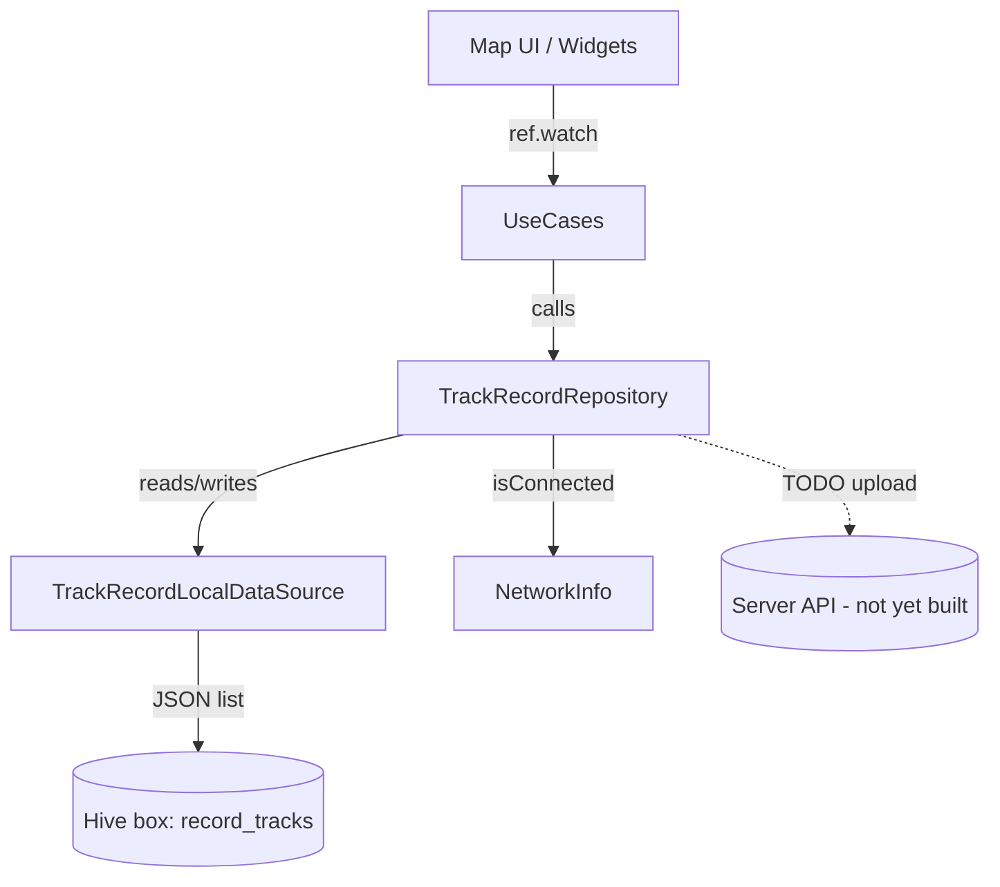

# Track Record Guide

Track Record is the offline-first GPS tracking feature (SW Maps-style) living
under the `map` feature. It captures ordered GPS samples into *tracks*, stores
them locally in Hive, and keeps an outbox so records can be pushed to a server
once the device is online — even though the upload endpoint does not exist yet.

## Overview

- A **TrackRecord** is one tracking session = an ordered list of **TrackPoint** GPS samples (lat/lng, altitude, speed, accuracy, timestamp).
- All data is written to Hive immediately (offline-first). No network call is required to record.
- Each record carries a `SyncStatus` (`pending` → `synced` / `failed`). New/edited records are `pending`.
- A repository-level outbox (`syncPending`) flushes `pending` records when online. The HTTP call is stubbed until the backend API lands.

## Architecture

Clean Architecture — datasources only touch storage/network; the repository orchestrates them and is the only type the domain/UI depends on.



### Layer responsibilities

| Layer | File | Role |
|-------|------|------|
| **Domain → entities** | `features/map/domain/entities/track_record.dart` | `TrackPoint`, `TrackRecord`, `enum SyncStatus` (pure, no Hive/json) |
| **Domain → repositories** | `features/map/domain/repositories/track_record_repository.dart` | `TrackRecordRepository` abstract contract, `Either<Failure, T>` |
| **Data → models** | `features/map/data/models/track_record_model.dart` | `TrackPointModel` / `TrackRecordModel` extends entity, `fromJson`/`toJson` |
| **Data → datasources** | `features/map/data/datasources/track_record_local_datasource.dart` | Hive access only (CRUD + outbox state) |
| **Data → repositories** | `features/map/data/repositories/track_record_repository_impl.dart` | Orchestrates local + network, hosts `syncPending` outbox logic |

> The `record_tracks` Hive box is opened once at startup in `main_common.dart`
> (`await Hive.openBox('record_tracks')`).

## Quick Start

```dart
// 1. Build the repository (wire local datasource + network info)
final repo = TrackRecordRepositoryImpl(
  localDataSource: TrackRecordLocalDataSourceImpl(),
  networkInfo: ref.watch(networkInfoProvider),
);

// 2. Start a track (saved locally, status = pending)
final Either<Failure, String> idResult = await repo.startTrack(name: 'Morning Run');

// 3. Stream GPS into the track
await repo.addPoint(
  id,
  latitude: -6.200,
  longitude: 106.800,
  altitude: 12.0,
  speed: 3.1,
);

// 4. Read all tracks (newest first)
final Either<Failure, List<TrackRecord>> tracks = await repo.getTracks();
tracks.fold(
  (failure) => log.e(failure.message),
  (list) => print('${list.length} tracks, total distance ${list.first.distanceMeters} m'),
);

// 5. Flush the outbox when online (upload call is stubbed for now)
final Either<Failure, int> synced = await repo.syncPending();
```

## API Reference

### Domain entity — `TrackRecord`

| Member | Type | Notes |
|--------|------|-------|
| `id` | `String` | Unique, millis timestamp |
| `name` | `String` | Display label |
| `note` | `String` | Optional description |
| `createdAt` | `DateTime` | Session start |
| `updatedAt` | `DateTime?` | Last edit |
| `points` | `List<TrackPoint>` | Ordered GPS samples |
| `syncStatus` | `SyncStatus` | `pending` (default) / `synced` / `failed` |
| `syncedAt` | `DateTime?` | Set when delivered |
| `distanceMeters` | `getter → double` | Sum of haversine between consecutive points |
| `duration` | `getter → Duration?` | Last point − first point |
| `copyWith(...)` | method | Immutable update |

`TrackPoint`: `latitude`, `longitude`, `altitude`, `speed`, `accuracy`, `timestamp`.

`SyncStatus`: `pending` · `synced` · `failed`.

### Domain repository — `TrackRecordRepository` (abstract)

All methods return `Future<Either<Failure, T>>`.

| Method | Returns | Purpose |
|--------|---------|---------|
| `getTracks()` | `Either<Failure, List<TrackRecord>>` | All tracks, newest first |
| `getTrack(id)` | `Either<Failure, TrackRecord>` | One track (left if missing) |
| `startTrack({name, note})` | `Either<Failure, String>` | Create empty track, returns id (`pending`) |
| `addPoint(id, {lat, lng, altitude, speed, accuracy, timestamp})` | `Either<Failure, Unit>` | Append a GPS sample |
| `saveTrack(TrackRecord)` | `Either<Failure, Unit>` | Upsert a full track (re-queues as `pending`) |
| `deleteTrack(id)` | `Either<Failure, Unit>` | Remove a track |
| `getPending()` | `Either<Failure, List<TrackRecord>>` | Records not yet delivered |
| `syncPending()` | `Either<Failure, int>` | Flush outbox, returns # synced (0 offline) |

### Local datasource — `TrackRecordLocalDataSource` (Hive only)

`openBox()`, `getAll()`, `getById(id)`, `startTrack(...)`, `addPoint(...)`,
`saveTrack(...)`, `deleteTrack(id)`, `clear()`, `markSynced(id)`,
`markFailed(id)`, `getPending()`.

The whole collection is stored as one JSON string under the `tracks` key in the
`record_tracks` box — atomic reads/writes, no Hive type adapter needed.

## Common Use Cases

1. **Record a walking/jogging session** — `startTrack` → loop `addPoint` from a
   location stream → `getTracks` to show the list with auto `distanceMeters`.
2. **Persist across app restarts** — data lives in Hive; reopen the app and
   `getTracks()` returns everything, even fully offline.
3. **Show sync state in UI** — read `syncStatus` on each record to render a
   "Pending" / "Synced" / "Failed" badge.
4. **Background flush** — call `syncPending()` from a connectivity listener
   (`isConnectedProvider`) or on app resume; it is a no-op when offline.
5. **Retry failed uploads** — `getPending()` returns `failed` records too, so
   the next `syncPending()` retries them automatically.
6. **Edit then re-sync** — `saveTrack` re-marks the record `pending`, so the
   updated version is pushed on the next sync.

## Best Practices

- ✅ Always go through the **repository**, never the datasource, from UI/usecase.
- ✅ Treat `syncPending()` as idempotent and safe to call repeatedly.
- ✅ Keep `TrackRecord`/`TrackPoint` free of Hive/JSON — serialization lives in `*Model`.
- ✅ Handle both sides of `Either` (`fold`) in the UI.
- ❌ Do not put sync/outbox logic in a datasource — orchestration belongs to the repository.
- ❌ Do not block the UI with large `syncPending()` loops; call it off the main path.

## Troubleshooting

**`StateError: Hive box "record_tracks" is not open`**
- The box must be opened at startup. Ensure `await Hive.openBox('record_tracks')`
  is present in `_initializeHive()` in `main_common.dart` (it is). If you hit
  this in tests, call `Hive.openBox('record_tracks')` in `setUp()`.

**Track not appearing after save**
- `saveTrack` re-queues as `pending` and overwrites by `id`. Confirm the `id`
  you pass matches an existing record, or use `startTrack` to create a new one.

**`syncPending()` returns 0 immediately**
- Expected when offline (`NetworkInfo.isConnected` is false). When online it
  returns 0 only if there are no `pending`/`failed` records.

**Upload never reaches a server**
- Intended for now: `_upload()` in `TrackRecordRepositoryImpl` is a stub that
  prints and returns `true`. Wire a real `RemoteDataSource.post(...)` when the
  backend endpoint ships (see TODO marker).

## Related Docs

- [Clean Architecture](CLEAN_ARCHITECTURE.md) — layer rules used here
- [Environment Setup](ENVIRONMENT_SETUP.md) — flavors & base URLs for the future upload endpoint
- [Logging Guide](LOGGING_GUIDE.md) — `log` used inside the sync stub
